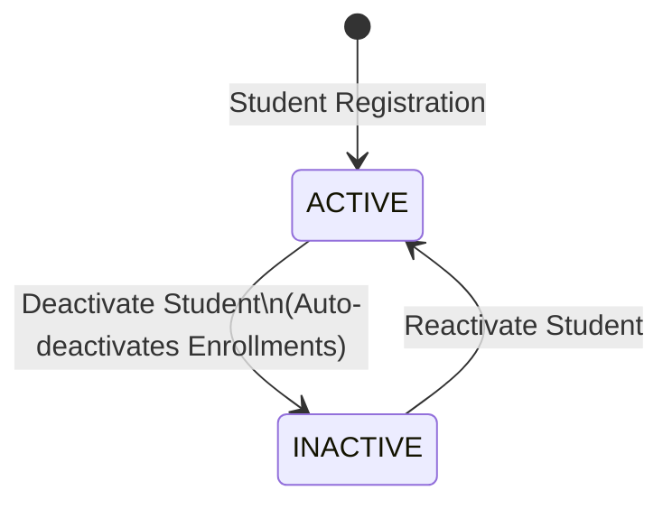
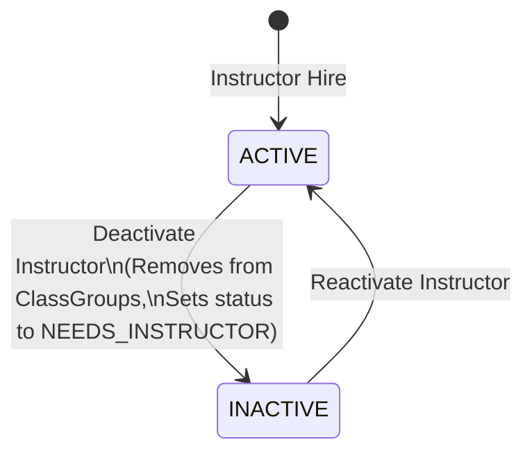
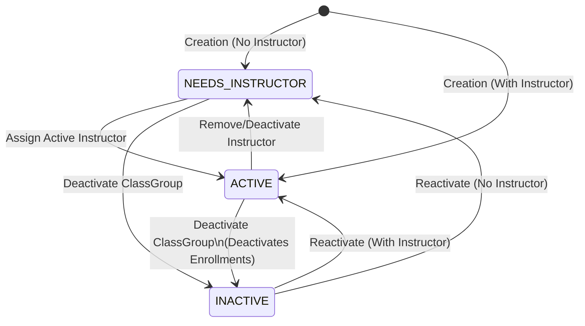
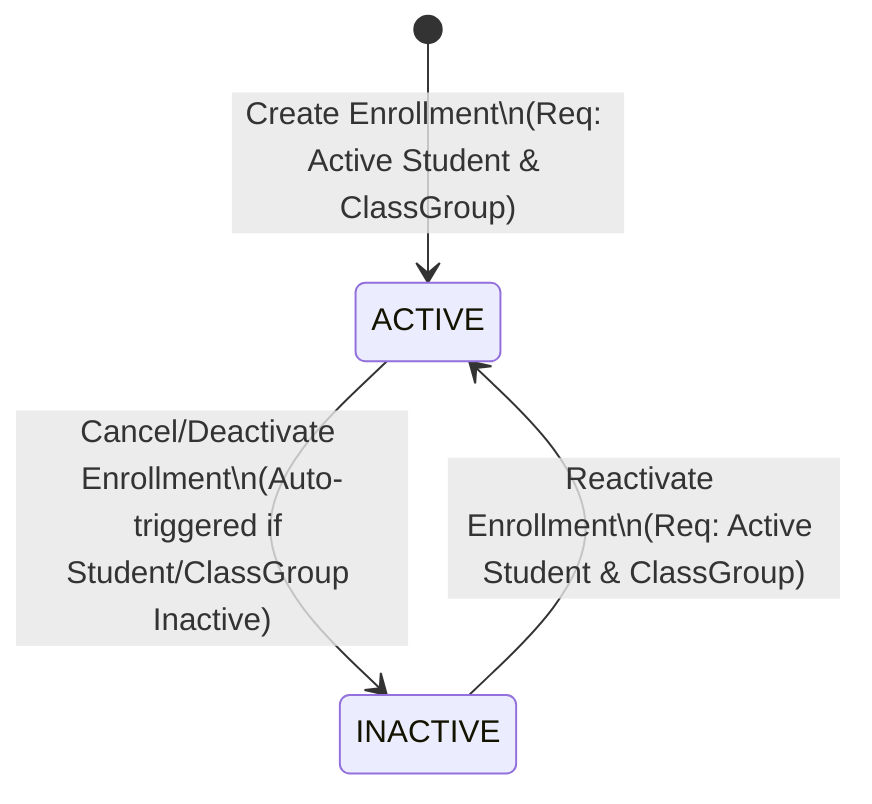
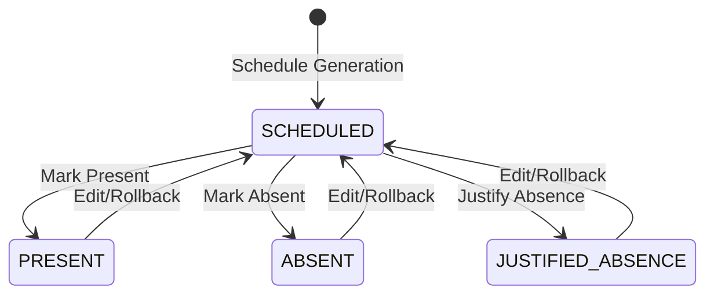
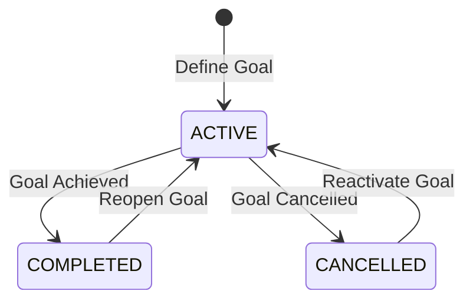
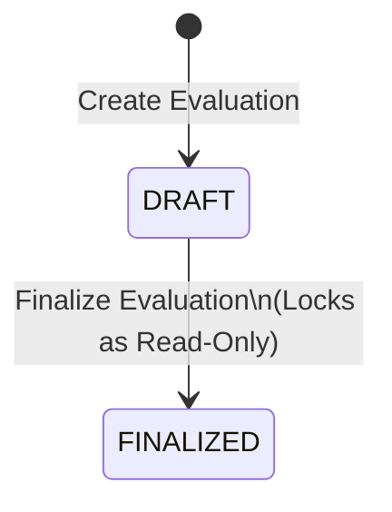
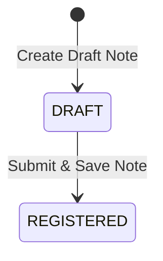

# Corely Pilates Studio SaaS - Entity Lifecycle & Business Rules

This document serves as the official, authoritative source of truth for the lifecycle states, transitions, validation rules, and business impacts of core operational entities in the Corely Pilates Studio Management SaaS platform. 

All future backend and frontend implementations must adhere strictly to the rules and diagrams defined in this document.

---

## Table of Contents
1. [Student](#1-student)
2. [Instructor](#2-instructor)
3. [ClassGroup](#3-classgroup)
4. [Enrollment](#4-enrollment)
5. [Attendance](#5-attendance)
6. [Objective](#6-objective)
7. [Evaluation](#7-evaluation)
8. [Evolution](#8-evolution)
9. [Dashboard Operational Rules](#9-dashboard-operational-rules)
10. [Summary State Matrix](#summary-state-matrix)

---

## 1. Student

### Purpose
Represents a customer or client registered at the Pilates studio to attend classes.

### States
* **`ACTIVE`**: The student is active, currently in good standing, eligible to enroll in classes, book sessions, and attend classes.
* **`INACTIVE`**: The student is suspended, cancelled, or has left the studio. They cannot attend classes or hold active enrollments.

### Allowed Transitions
| Source State | Target State | Trigger / Condition |
| :--- | :--- | :--- |
| `[*]` (None) | `ACTIVE` | Initial student registration. |
| `ACTIVE` | `INACTIVE` | Suspension, subscription cancellation, or manual deactivation. |
| `INACTIVE` | `ACTIVE` | Reactivation of account or subscription renewal. |

### Mermaid State Diagram

### Business Rules
* **Deactivation (`ACTIVE` -> `INACTIVE`)**: 
  * Automatically transitions all **active enrollments** associated with the student to `INACTIVE`.
  * All historical operational data (past attendance records, finalized evaluations, evolution notes, past payments) **must remain intact** for compliance, auditing, and reporting.

### Side Effects
* Deactivating a student triggers a status change cascade to `INACTIVE` for all their active `Enrollment`s.
* Future class attendance slots scheduled for this student must be automatically cancelled or removed.

### Validation Rules
* An `INACTIVE` student cannot have active enrollments.
* An `INACTIVE` student cannot be registered for new class attendances.

### Historical Data Behavior
* Historical data is preserved. Soft-delete / status-based inactive status only; data is never physically deleted.

### Dashboard Impact
* **Active Status**: Active students contribute to the total active student count and capacity utilization.
* **Inactive Status**: Inactive students are immediately filtered out from the current active roster, but their historic attendance and payments remain visible in chronological analytics reports.

---

## 2. Instructor

### Purpose
Represents a Pilates teacher or trainer who conducts classes, logs student evolutions, and conducts physical evaluations.

### States
* **`ACTIVE`**: The instructor is working at the studio and can be assigned to class groups, conduct sessions, and register student progression.
* **`INACTIVE`**: The instructor has left, is suspended, or is on long-term leave. They cannot lead active classes or write records.

### Allowed Transitions
| Source State | Target State | Trigger / Condition |
| :--- | :--- | :--- |
| `[*]` (None) | `ACTIVE` | Hiring / Registration. |
| `ACTIVE` | `INACTIVE` | Resignation, suspension, or manual deactivation. |
| `INACTIVE` | `ACTIVE` | Reactivation / Rehire. |

### Mermaid State Diagram

### Business Rules
* **Deactivation (`ACTIVE` -> `INACTIVE`)**:
  * The instructor must be automatically removed from all active class groups where they are currently assigned.
  * For each class group affected by the instructor's removal, the status of that class group must be updated to `NEEDS_INSTRUCTOR`.

### Side Effects
* Associated `ClassGroup` entities lose their assigned instructor and transition to `NEEDS_INSTRUCTOR`.
* Future class occurrences scheduled for the deactivated instructor must be flagged for rescheduling or reassignment to an active instructor.

### Validation Rules
* Only `ACTIVE` instructors can be assigned to a class group.
* Only `ACTIVE` instructors can log `Attendance`, write `Evolution` notes, or finalize `Evaluation`s.

### Historical Data Behavior
* All past operations logged by the instructor (past class attendances, finalized student evaluations, past progress logs) remain permanently associated with the instructor's profile in the historical logs.

### Dashboard Impact
* **Active Status**: Counted in active staff capacity and scheduled working hours.
* **Inactive Status**: Removed from the active scheduler.
* **Deactivation Alert**: Triggers a notification on the admin dashboard for any class groups that now transition to `NEEDS_INSTRUCTOR` as a result of the deactivation.

---

## 3. ClassGroup

### Purpose
Represents a defined class slot scheduled at recurring days and times, with a specified maximum capacity and an assigned instructor.

### States
* **`ACTIVE`**: The class group is operational and has an assigned active instructor.
* **`INACTIVE`**: The class group has been disbanded, cancelled, or paused.
* **`NEEDS_INSTRUCTOR`**: The class group is scheduled but does not have an active instructor assigned.

### Allowed Transitions
| Source State | Target State | Trigger / Condition |
| :--- | :--- | :--- |
| `[*]` (None) | `NEEDS_INSTRUCTOR`| Class created without assigning an instructor. |
| `[*]` (None) | `ACTIVE` | Class created with an active instructor assigned. |
| `NEEDS_INSTRUCTOR`| `ACTIVE` | Active instructor is assigned to the group. |
| `ACTIVE` | `NEEDS_INSTRUCTOR`| Assigned instructor is removed or deactivated. |
| `ACTIVE` | `INACTIVE` | Class group is dissolved / deactivated. |
| `NEEDS_INSTRUCTOR`| `INACTIVE` | Class group is dissolved / deactivated. |
| `INACTIVE` | `NEEDS_INSTRUCTOR`| Reactivated without assigning an instructor. |
| `INACTIVE` | `ACTIVE` | Reactivated with an active instructor assigned. |

### Mermaid State Diagram

### Business Rules
* **Deactivation (`ACTIVE` -> `INACTIVE`)**:
  * Automatically transitions all **active enrollments** in this class group to `INACTIVE`.
* **Activation Requirements**:
  * A class group cannot transition to `ACTIVE` without a valid, `ACTIVE` instructor assigned to it.

### Side Effects
* Deactivating a class group deactivates all active `Enrollment`s linked to it.
* Future class attendance slots scheduled for this class group are cancelled.

### Validation Rules
* Enforcing capacity: A student cannot be enrolled if the number of active enrollments in the class group equals or exceeds its maximum capacity limit.
* The assigned instructor must be `ACTIVE`.

### Historical Data Behavior
* Historical records of the class group's past occurrences, attendance logs, and past enrollments remain preserved for auditing and retention analytics.

### Dashboard Impact
* **Active Status**: Factors into occupancy rates, schedule grids, and available class slots.
* **Needs Instructor Status**: Triggers an alert on the administration dashboard indicating a class requires instructor assignment.
* **Inactive Status**: Omitted from current schedules and current capacity metrics.

---

## 4. Enrollment

### Purpose
Represents the contract/registration linking a student to a class group, granting permission to attend classes.

### States
* **`ACTIVE`**: The student is actively enrolled and registered to attend the sessions of the class group.
* **`INACTIVE`**: The enrollment has ended, has been cancelled, or the student has been deactivated.

### Allowed Transitions
| Source State | Target State | Trigger / Condition |
| :--- | :--- | :--- |
| `[*]` (None) | `ACTIVE` | Student is enrolled in the class group. |
| `ACTIVE` | `INACTIVE` | Cancellation, course completion, student deactivation, or class group deactivation. |
| `INACTIVE` | `ACTIVE` | Re-enrollment or reactivation. |

### Mermaid State Diagram

### Business Rules
* **Duplicate Prevention**: A student **cannot** have more than one active enrollment in the same class group at the same time.
* **Inactive Block**: Active enrollment of a student who is currently `INACTIVE` is strictly prohibited.
* **Automatic Deactivation**:
  * If a `Student` changes state from `ACTIVE` to `INACTIVE`, their associated `Enrollment` status must automatically transition to `INACTIVE`.
  * If a `ClassGroup` changes state from `ACTIVE` to `INACTIVE`, all associated `Enrollment` statuses must automatically transition to `INACTIVE`.

### Side Effects
* When an enrollment becomes `INACTIVE`, future automatically generated attendance slots for this student in this class group are cancelled.

### Validation Rules
* Parent entities validation: The `Student` must be `ACTIVE`, and the `ClassGroup` must be `ACTIVE` or `NEEDS_INSTRUCTOR`.
* The class group capacity limit must not be exceeded.

### Historical Data Behavior
* Enrollment start dates, end dates, and historical status changes are preserved for financial auditing and retention reporting.

### Dashboard Impact
* Active enrollments determine the real-time capacity usage percentage and subscription metrics displayed on studio performance widgets. Inactive enrollments are excluded.

---

## 5. Attendance

### Purpose
Logs a student's participation status in a specific scheduled session.

### States/Outcomes
Unlike core master entities, Attendance acts as a transactional record tracking specific outcomes:
* **`SCHEDULED`**: The class slot is planned, but attendance has not been registered yet.
* **`PRESENT`**: The student attended the class.
* **`ABSENT`**: The student did not attend and did not provide a valid excuse.
* **`JUSTIFIED_ABSENCE`**: The student missed the class but provided a valid justification, making them eligible for a makeup class.

### Allowed Transitions
| Source State | Target State | Trigger / Condition |
| :--- | :--- | :--- |
| `[*]` (None) | `SCHEDULED` | Generated as part of the class schedule cycle. |
| `SCHEDULED` | `PRESENT` | Instructor marks the student as present. |
| `SCHEDULED` | `ABSENT` | Instructor marks the student as absent. |
| `SCHEDULED` | `JUSTIFIED_ABSENCE` | Admin/Instructor registers a justified absence. |
| `PRESENT` / `ABSENT` / `JUSTIFIED_ABSENCE` | `SCHEDULED` | Rollback or adjustment of the attendance log. |

### Mermaid State Diagram

### Business Rules
* **Operational Activity Requirement**: Attendance can **only** be registered when all of the following conditions are met:
  1. The `Student` state is **`ACTIVE`**
  2. The student's `Enrollment` in the class is **`ACTIVE`**
  3. The `ClassGroup` state is **`ACTIVE`**
  4. The assigned `Instructor` state is **`ACTIVE`**

### Side Effects
* Marking a student as `JUSTIFIED_ABSENCE` may issue a makeup credit/token to the student.
* Transitioning to `PRESENT` allows the instructor to record an `Evolution` entry for the student for that session.

### Validation Rules
* Block attendance logs if any of the parent entities (Student, Enrollment, ClassGroup, Instructor) are in an `INACTIVE` state (or `NEEDS_INSTRUCTOR` state for the ClassGroup).
* Attendance cannot be logged for future dates.

### Historical Data Behavior
* Attendance records are immutable once finalized (unless edited by authorized administrative roles) and are preserved indefinitely for compliance and usage reports.

### Dashboard Impact
* Feeds studio utilization graphs, monthly attendance rates, student attendance consistency metrics, and makeup session queues.

---

## 6. Objective

### Purpose
Defines a target milestone or health/fitness goal (e.g., core strength, rehabilitation, pain relief) set for a student.

### States
* **`ACTIVE`**: The goal is current and being pursued during sessions.
* **`COMPLETED`**: The goal has been successfully reached.
* **`CANCELLED`**: The goal has been abandoned or is no longer relevant.

### Allowed Transitions
| Source State | Target State | Trigger / Condition |
| :--- | :--- | :--- |
| `[*]` (None) | `ACTIVE` | Goal is defined for the student. |
| `ACTIVE` | `COMPLETED` | Objective is marked as achieved. |
| `ACTIVE` | `CANCELLED` | Objective is cancelled. |
| `COMPLETED` | `ACTIVE` | Reopening a completed goal. |
| `CANCELLED` | `ACTIVE` | Reactivating a cancelled goal. |

### Mermaid State Diagram

### Business Rules
* Objectives are always linked to a specific `Student`.

### Side Effects
* Completing or cancelling an objective does not alter class schedules or enrollments, but affects the active milestone tracking list for the student.

### Validation Rules
* Cannot create or reactivate an objective for an `INACTIVE` student.

### Historical Data Behavior
* Objectives remain on the student's profile indefinitely, providing a chronological timeline of their goals and achievements.

### Dashboard Impact
* Used to compile statistics on student progress (e.g., average time to complete objectives, total active goals per student).

---

## 7. Evaluation

### Purpose
A detailed physical assessment (posture analysis, measurements, movement limitations, clinical observations) performed on a student.

### States
* **`DRAFT`**: The assessment is being filled out by the instructor and can be modified.
* **`FINALIZED`**: The assessment is complete and locked to prevent modification, ensuring clinical integrity.

### Allowed Transitions
| Source State | Target State | Trigger / Condition |
| :--- | :--- | :--- |
| `[*]` (None) | `DRAFT` | Evaluation is started. |
| `DRAFT` | `FINALIZED` | Evaluation is completed and signed off. |

### Mermaid State Diagram

### Business Rules
* Once an evaluation transitions to `FINALIZED`, it is **read-only** and cannot be edited, modified, or deleted by any user (except for system administrators under extreme conditions, subject to auditing).

### Side Effects
* Finalization of an evaluation may auto-generate suggested `Objective`s or progress milestones for the student.

### Validation Rules
* The student must be `ACTIVE`.
* The conducting instructor must be `ACTIVE`.

### Historical Data Behavior
* Finalized evaluations are permanent records and must be preserved intact indefinitely.

### Dashboard Impact
* Generates alerts for administrative staff indicating when a student is overdue for their periodic re-evaluation (e.g., more than 6 months since the last finalized evaluation).

---

## 8. Evolution

### Purpose
Logs daily, session-by-session progression notes, documenting exercises executed, weight/resistance levels, pain levels, and student feedback.

### States
* **`DRAFT`**: The notes are being recorded during or immediately after the class.
* **`REGISTERED`**: The notes are finalized and submitted.

### Allowed Transitions
| Source State | Target State | Trigger / Condition |
| :--- | :--- | :--- |
| `[*]` (None) | `DRAFT` | Evolution draft is created for a class session. |
| `DRAFT` | `REGISTERED` | Evolution notes are finalized and saved. |

### Mermaid State Diagram

### Business Rules
* Evolution logs must be associated with a specific, valid class session and `Attendance` record (confirming presence).
* Can only be written by the instructor who conducted the class (or an authorized administrative replacement).

### Side Effects
* Feeds student progress charts.

### Validation Rules
* Student, class group, and instructor must be `ACTIVE` (or the instructor must have been active at the time of the class).
* An evolution log cannot be created for a student marked `ABSENT` without a justification or if they did not attend.

### Historical Data Behavior
* Daily evolutions are critical clinical records and are stored permanently.

### Dashboard Impact
* Feeds student timeline widgets, letting instructors view past exercise history during active sessions.

---

## 9. Dashboard Operational Rules

The Dashboard is an aggregated reporting layer rather than a transactional entity. It has no state of its own, but its calculations are governed by strict business logic rules.

### Rule: Active Operations Focus
* All real-time, operational, and active metrics **must filter out inactive entities**.
* Specifically, calculations for:
  * **Current Capacity Rate**
  * **Occupancy Metrics**
  * **Instructor Working Loads**
  * **Active Student Count**
  * **Daily Schedule Grids**
* must only aggregate data from:
  * `Student.state == ACTIVE`
  * `Instructor.state == ACTIVE`
  * `ClassGroup.state == ACTIVE` (or `NEEDS_INSTRUCTOR` for schedule warning lists)
  * `Enrollment.state == ACTIVE`

### Rule: Historical Reports
* Historical trend reports (e.g., month-over-month billing trends, past quarterly attendance rates, historical instructor performance) **must include** historical data of entities that are currently `INACTIVE` to ensure accurate reporting.

---

## Summary State Matrix

| Entity | States | Allowed Actions / Transitions | Dashboard Operational Status |
| :--- | :--- | :--- | :--- |
| **Student** | `ACTIVE`, `INACTIVE` | `ACTIVE` $\leftrightarrow$ `INACTIVE` | Only `ACTIVE` counted in current rosters/capacity. |
| **Instructor** | `ACTIVE`, `INACTIVE` | `ACTIVE` $\leftrightarrow$ `INACTIVE` | Only `ACTIVE` shown in current schedules/workloads. |
| **ClassGroup** | `ACTIVE`, `INACTIVE`, `NEEDS_INSTRUCTOR` | `ACTIVE` $\leftrightarrow$ `NEEDS_INSTRUCTOR` $\leftrightarrow$ `INACTIVE` | `ACTIVE` and `NEEDS_INSTRUCTOR` (as alert) shown. |
| **Enrollment** | `ACTIVE`, `INACTIVE` | `ACTIVE` $\leftrightarrow$ `INACTIVE` | Only `ACTIVE` determines class occupancy. |
| **Attendance** | `SCHEDULED`, `PRESENT`, `ABSENT`, `JUSTIFIED_ABSENCE` | `SCHEDULED` $\rightarrow$ `PRESENT`/`ABSENT`/`JUSTIFIED_ABSENCE` | Aggregated for operational attendance stats. |
| **Objective** | `ACTIVE`, `COMPLETED`, `CANCELLED` | `ACTIVE` $\leftrightarrow$ `COMPLETED`/`CANCELLED` | Only `ACTIVE` shown in active student goal sheets. |
| **Evaluation** | `DRAFT`, `FINALIZED` | `DRAFT` $\rightarrow$ `FINALIZED` | Overdue re-evaluations generate admin alerts. |
| **Evolution** | `DRAFT`, `REGISTERED` | `DRAFT` $\rightarrow$ `REGISTERED` | Feeds the active student progress charts. |
